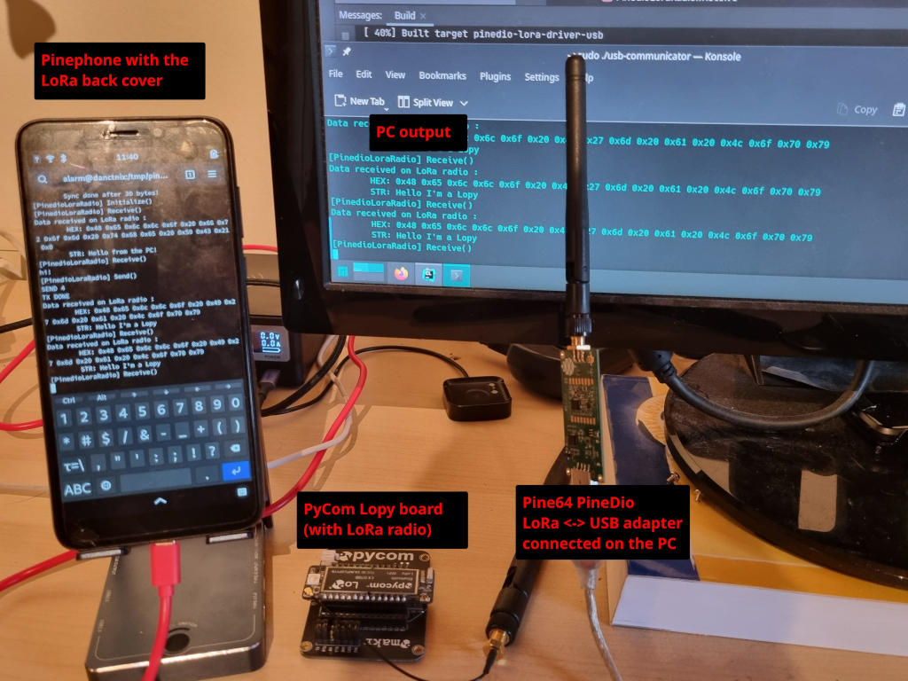

# PineDio LoRa drivers
PineDio is the new LoRa-based product range at [Pine64](https://pine64.org). This project implements a C++ driver for the [LoRa USB adapter](https://wiki.pine64.org/wiki/Pinedio#USB_adapter) and the [Pinephone backplate](https://wiki.pine64.org/wiki/Pinedio#Pinephone_backplate).

## Build
Build this project like any CMake project:
 - Clone the project from Git
 - Initialize/update the Git submodules
 - Create a build directory and invoke CMake with command line parameters to choose the target hardware
 - Build
 - Enjoy

```bash
git clone xxx
cd pinedio-lora-driver
git submodule update --init
mkdir build && cd build
cmake -DBUILD_FOR_PINEPHONE=0 -DBUILD_FOR_USB=1 ..
make -j
```

2 CMake options are available : 
- `BUILD_FOR_PINEPHONE` : build the driver for the pinephone backplate and the `pinephone-communicator` test app.
- `BUILD_FOR_USB` : build the driver for the USB adapter and the `usb-communicator` test app.

## Dependencies
You need to install and load [this driver](https://github.com/rogerjames99/spi-ch341-usb) to be able to use the USB adapter. This spi-ch341-usb is a driver that configures the CH341 chip (USB <-> serial converter) mounted on the USB adapter and exposes it as a `spidev` (userland SPI API) device.

## Run the test applications
The test applications (one for the Pinephone, one for the USB adapter) provide a very basic chat application : it prints all the data received on the LoRa radio and allows sending messages to other LoRa devices.

The *communicator* test app are available in the directory `apps/` : 

```bash
./apps/pinephone-communicator/pinephone-communicator
```
or
```bash
./apps/usb-communicator/usb-communicator
```

## Demo


[Here's a video showcasing this project](https://video.codingfield.com/videos/watch/5a68be9e-01a2-43aa-af60-595366619553). 

## Overview of the project structure
The goal of this implementation is to provide a common interface for both devices (Pinephone add-on and USB adapter) as they are both based on the same LoRa module (Semtech SX1262).

The implementation specific for the Pinephone is located in the class `PineDio::LoRa::PinephoneBackplate`. It initializes the I²C port to communicate with the LoRa backplate. The LoRa backplate PCB is based on the SX1262 and uses a simple ATtiny84 MCU to convert the I²C bus from the Pinephone into the SPI bus for the SX1262 (it run [this firmware](https://github.com/zschroeder6212/tiny-i2c-spi)).

The implementation specific for the USB adapter is located in the class `PineDio::LoRa::UsbAdapter`. It uses the `spidev` API to access the SPI bus from the Linux userland.

Both classes derive from `SX126x`, the generic driver from [this repo](https://github.com/SudoMaker/sx126x_driver).

The generic abstraction is provided by the class `PineDio::LoRa::PinedioLoraRadio`, which takes a  reference to a `SX126x`-derived object (which can be either `PinephoneBackplate` or `UsbAdapter`).

At the application level, all you have to do is instantiate the driver for the targeted device and configure it if necessary, pass it to an instance of PineDioLoraRadio and then use this instance to send and receive data:

```c++
PineDio::LoRa::PinephoneBackplate pinephoneBackplate("/dev/i2c-2");
pinephoneBackplate.Initialize();
PineDio::LoRa::PinedioLoraRadio radio(pinephoneBackplate);
radio.Send({...});
auto data = radio.Receive();
```
or
```c++
PineDio::LoRa::UsbAdapter usbAdapter;
PineDio::LoRa::PinedioLoraRadio radio(usbAdapter);
radio.Send({...});
auto data = radio.Receive();
```

Linking with this driver in an external application should be as easy as linking (`target_link_libraries`) with `pinedio-lora-driver` and `pinedio-lora-driver-usb` or `pinedio-lora-driver-pinephone`. See *communicator* demo applications in the folder `apps`.

## Current state of this project
This project is at its very beginning. There are still a lot of unnecessary `sleep()`, and most of the configuration is hard-coded.

The test application (usb-communicator and pinephone-communicator) are also in a very early stage of development. They are already able to print all data received on the LoRa radio and to send messages from the standard input.

### TODO
 - [ ] Remove unnecessary `sleep()`
 - [ ] Remove hard-coded configuration in the driver, add API to configure the driver
 - [ ] Communicator test app: configure the driver parameters (frequency, LoRa settings,..) via command line options and/or configuration file
 - [ ] Improve the implementation to provide synchronous and asynchronous API
 - [ ] Probably many other things

## License
This project is released under the terms of the **LGPLv3 license**.

## Acknowledgements
This project is based on [this C++ SX126x driver](https://github.com/SudoMaker/sx126x_driver) from [SudoMaker](https://github.com/SudoMaker). 

The implementation of the driver for the USB adapter is possible thanks to [rogerjames99's](https://github.com/rogerjames99) [fork](https://github.com/rogerjames99/spi-ch341-usb) of the [spi-ch341-usb module](https://github.com/gschorcht/spi-ch341-usb) from [Gunar Schorcht](https://github.com/gschorcht).

The LoRa add-on board works thanks to a ATtiny MCU running [this firmware](https://github.com/zschroeder6212/tiny-i2c-spi) from [Zachary Schroeder](https://github.com/zschroeder6212).

This project wouldn't be possible without the good work from [Pine64](https://pine64.org), which works hands in hands with the open source community to design and build nice and open devices!